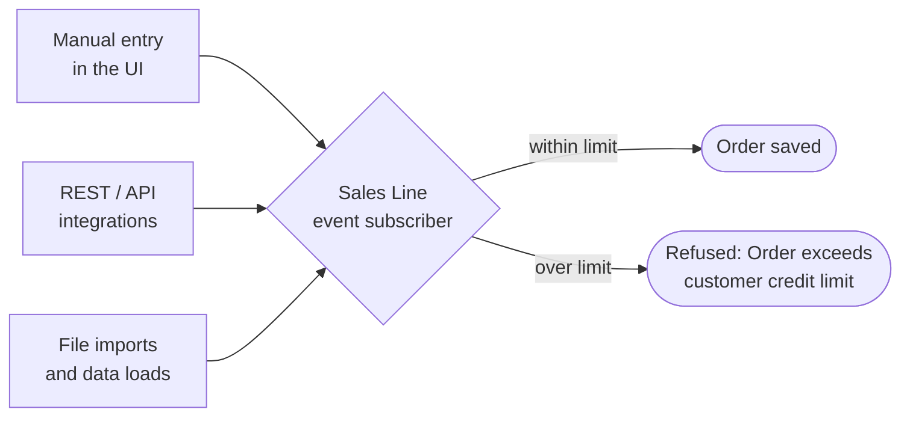

# Dynamics 365 Business Central (AL extension)

  

Every entry path goes through the same check, because it lives in an event subscriber rather than in a screen.

| File | What it is |
|---|---|
| `src/AIDVCreditLimit.Codeunit.al` | Event subscribers on Sales Line insert/modify: hard credit-limit block (UI and API) |
| `src/AIDVOpenOrdersByCust.Query.al` | Query: open order lines, value and oldest date per customer |
| `src/AIDVOpenOrdersByCust.Page.al` + `...Buffer.Table.al` | List page under Reports & Analysis |
| `src/AIDVSalesControls.PermissionSet.al` | Permission set |
| [`shopify-erp-order-sync` › `business-central.js`](https://github.com/Milo-ai-HQ/shopify-erp-order-sync/blob/main/src/adapters/business-central.js) | API v2.0 deep insert, idempotent on `externalDocumentNumber` |

No base-app changes: everything is events and new objects, so it survives upgrades. Build with the AL
Language extension (`AL: Package`), ID range 50100–50149.

---

## The same scenario, other platforms

Open orders by customer, a hard credit-limit block, and a Shopify order feed — built natively on each ERP:

- [Priority — Credit Control](https://github.com/Milo-ai-HQ/priority-credit-control)
- [Priority — Order Load Interface](https://github.com/Milo-ai-HQ/priority-order-load-interface)
- [NetSuite — Sales Controls](https://github.com/Milo-ai-HQ/netsuite-sales-controls)
- [Odoo — Sales Controls](https://github.com/Milo-ai-HQ/odoo-sales-controls)
- [Shopify → ERP Order Sync](https://github.com/Milo-ai-HQ/shopify-erp-order-sync)
